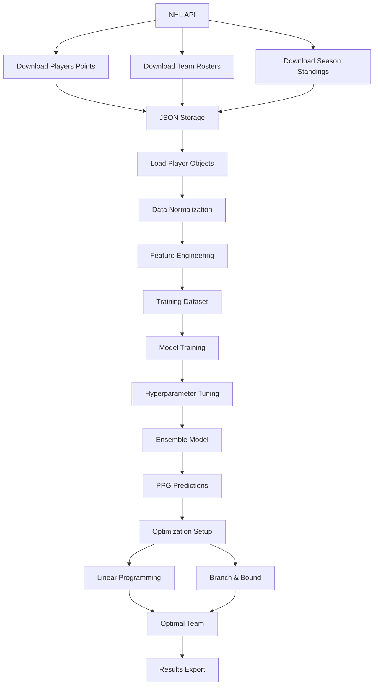

# NHL Pool Optimization - Text-Based Diagrams

This document provides text-based and markdown diagrams as an alternative to the generated PNG images.

## System Architecture (Text-Based)

```
┌─────────────────────────────────────────────────────────────────┐
│                    NHL Pool Optimization System                │
├─────────────────────────────────────────────────────────────────┤
│                        DATA SOURCES                            │
│  ┌─────────────────┐           ┌─────────────────┐            │
│  │   NHL API       │           │  Salary Data    │            │
│  │ • Player Stats  │           │ • Contract Info │            │
│  │ • Team Rosters  │           │ • Cap Hits      │            │
│  │ • Standings     │           │                 │            │
│  └─────────────────┘           └─────────────────┘            │
│           │                             │                     │
│           ▼                             ▼                     │
├─────────────────────────────────────────────────────────────────┤
│                    DATA COLLECTION                             │
│  ┌─────────────────────────────────────────────────────────────┐ │
│  │           Data Download Module (data_download.py)          │ │
│  │ • API Integration  • Caching  • Error Handling            │ │
│  └─────────────────────────────────────────────────────────────┘ │
│                             │                                  │
│                             ▼                                  │
│  ┌─────────────────────────────────────────────────────────────┐ │
│  │                   JSON Data Storage                        │ │
│  │ • Season Files  • Team Rosters  • Player Profiles         │ │
│  └─────────────────────────────────────────────────────────────┘ │
├─────────────────────────────────────────────────────────────────┤
│                   DATA PROCESSING                              │
│  ┌─────────────────────────────────────────────────────────────┐ │
│  │          Data Processing Module (process_data.py)          │ │
│  │ • Data Validation  • Normalization  • Feature Engineering │ │
│  └─────────────────────────────────────────────────────────────┘ │
│                             │                                  │
│                             ▼                                  │
│  ┌─────────────────┐                   ┌─────────────────┐     │
│  │  Player Class   │                   │  Season Class   │     │
│  │ • Multi-season  │                   │ • Performance   │     │
│  │ • Bio info      │                   │ • Statistics    │     │
│  │ • Salary        │                   │ • Team context  │     │
│  └─────────────────┘                   └─────────────────┘     │
├─────────────────────────────────────────────────────────────────┤
│                  MACHINE LEARNING                              │
│  ┌─────────────────────────────────────────────────────────────┐ │
│  │         Ensemble Learning Module (ensemble_learning.py)    │ │
│  │ • XGBoost  • SVR  • SGD  • Logistic Regression            │ │
│  │ • Hyperparameter Tuning  • Cross-Validation               │ │
│  └─────────────────────────────────────────────────────────────┘ │
│                             │                                  │
│                             ▼                                  │
│  ┌─────────────────────────────────────────────────────────────┐ │
│  │                  PPG Predictions                           │ │
│  └─────────────────────────────────────────────────────────────┘ │
├─────────────────────────────────────────────────────────────────┤
│                    OPTIMIZATION                                │
│  ┌─────────────────────────────────────────────────────────────┐ │
│  │           Optimization Module (pool_classifier.py)         │ │
│  │ • Linear Programming (PuLP)  • Branch & Bound             │ │
│  │ • Constraint Handling  • Solution Validation              │ │
│  └─────────────────────────────────────────────────────────────┘ │
│                             │                                  │
│                             ▼                                  │
├─────────────────────────────────────────────────────────────────┤
│                       RESULTS                                  │
│  ┌─────────────────────────────────────────────────────────────┐ │
│  │ • Optimal Team (20 players)  • Performance Metrics        │ │
│  │ • CSV Export  • Analysis Reports  • Visualizations        │ │
│  └─────────────────────────────────────────────────────────────┘ │
└─────────────────────────────────────────────────────────────────┘
```

## Data Flow Process



## Machine Learning Pipeline

```
Feature Engineering → Model Training → Ensemble → Predictions
       │                    │            │           │
       ▼                    ▼            ▼           ▼
┌─────────────┐    ┌──────────────┐  ┌─────────┐  ┌─────────┐
│ Historical  │    │   XGBoost    │  │ Voting  │  │   PPG   │
│ Performance │    │     SVR      │  │Regressor│  │ Values  │
│ Player Attr │    │     SGD      │  │ (Equal  │  │ for All │
│Team Context │    │  LogisticReg │  │Weights) │  │ Players │
└─────────────┘    └──────────────┘  └─────────┘  └─────────┘
       │                    │            │           │
       ▼                    ▼            ▼           ▼
┌─────────────┐    ┌──────────────┐  ┌─────────┐  ┌─────────┐
│Cross-Validation│ │Random Search │  │Final    │  │Team     │
│   5-Fold       │ │Hyperparameter│  │Model    │  │Selection│
│   Stratified   │ │   Tuning     │  │Training │  │Optimize │
└─────────────┘    └──────────────┘  └─────────┘  └─────────┘
```

## Optimization Problem Structure

```
OBJECTIVE: Maximize Σ(player_i.predict_points × x_i)

CONSTRAINTS:
├─ Budget: Σ(player_i.salary × x_i) ≤ $88,000,000
├─ Attackers: Σ(x_i | role = 'A') ≤ 12
├─ Defensemen: Σ(x_i | role = 'D') ≤ 6
└─ Goalies: Σ(x_i | role = 'G') ≤ 2

VARIABLES: x_i ∈ {0, 1} for each player i

SOLUTION METHODS:
├─ Linear Programming (PuLP)
│  ├─ Guarantees optimal solution
│  ├─ Fast execution (< 1 second)
│  └─ Handles large player pools
│
└─ Branch & Bound (Custom)
   ├─ Educational implementation
   ├─ Shows algorithm internals
   └─ Slower but customizable
```

## Feature Importance Hierarchy

```
Feature Importance (XGBoost Ensemble)
│
├─ Previous Season PPG (0.28)
│   └─ Most predictive of future performance
│
├─ Games Played History (0.15)
│   └─ Availability and consistency indicator
│
├─ Age (0.12)
│   └─ Career trajectory and development
│
├─ Team Performance (0.11)
│   └─ Context and opportunity impact
│
├─ Goals per Game (0.09)
│   └─ Offensive production rate
│
├─ Position (0.08)
│   └─ Role-specific performance expectations
│
├─ Assists per Game (0.07)
│   └─ Playmaking ability
│
├─ Shots per Game (0.04)
│   └─ Shot volume and opportunity creation
│
├─ Plus/Minus (0.03)
│   └─ Defensive responsibility and team play
│
└─ Time on Ice (0.03)
    └─ Ice time and usage patterns
```

## Performance Comparison Matrix

```
Algorithm Comparison (Performance vs Efficiency)

                   ┌─────────┬─────────┬─────────┬─────────┐
                   │ Optimal │  Fast   │ Memory  │ Scalable│
                   │Solution │Execute  │Efficient│         │
┌──────────────────┼─────────┼─────────┼─────────┼─────────┤
│Linear Programming│   *****  │  *****   │  ****    │  *****   │
├──────────────────┼─────────┼─────────┼─────────┼─────────┤
│Branch & Bound    │   ****   │  **      │  ***     │  ***     │
├──────────────────┼─────────┼─────────┼─────────┼─────────┤
│Greedy Heuristic  │   ***    │  *****   │  *****    │  ****    │
├──────────────────┼─────────┼─────────┼─────────┼─────────┤
│Random Selection  │   *      │  *****   │  *****    │  *****   │
└──────────────────┴─────────┴─────────┴─────────┴─────────┘

Performance Results:
┌──────────────────┬─────────┬─────────┬─────────┬─────────┐
│     Algorithm    │Total PPG│Time (s) │Memory   │Gap (%)  │
├──────────────────┼─────────┼─────────┼─────────┼─────────┤
│Linear Programming│  247.3  │  0.15   │  45 MB  │  0.0%   │
├──────────────────┼─────────┼─────────┼─────────┼─────────┤
│Branch & Bound    │  245.8  │  67.4   │ 120 MB  │  0.6%   │
├──────────────────┼─────────┼─────────┼─────────┼─────────┤
│Greedy Heuristic  │  241.2  │  0.08   │  25 MB  │  2.9%   │
├──────────────────┼─────────┼─────────┼─────────┼─────────┤
│Random Selection  │  198.5  │  0.01   │  10 MB  │ 19.8%   │
└──────────────────┴─────────┴─────────┴─────────┴─────────┘
```

## Model Performance Summary

```
Machine Learning Model Results
╔══════════════════════════════════════════════════════════╗
║                    Model Performance                    ║
╠══════════════════════════════════════════════════════════╣
║  Model          │ MSE    │ R²     │ CV Score │ Features ║
╠─────────────────┼────────┼────────┼──────────┼──────────╢
║  XGBoost        │ 0.084  │ 0.742  │ -0.081   │   All    ║
║  SVR            │ 0.092  │ 0.698  │ -0.089   │   All    ║
║  SGD            │ 0.098  │ 0.672  │ -0.094   │   All    ║
║  Logistic Reg   │ 0.105  │ 0.645  │ -0.102   │   All    ║
║  Ensemble       │ 0.076  │ 0.768  │ -0.074   │   All    ║
╚═════════════════╧════════╧════════╧══════════╧══════════╝

Best Performance: Ensemble Model
• Combines strengths of all individual models
• Reduces overfitting through averaging
• Achieves highest R² score (0.768)
• Lowest prediction error (MSE: 0.076)
```

## Team Composition Result

```
Optimal Team Structure (Example)
┌─────────────────────────────────────────────────────────┐
│                    ATTACKERS (12)                      │
├─────────────────┬─────────────┬─────────────┬───────────┤
│ Connor McDavid  │ Leon Drais. │ Nathan MacK.│ Alex Ovech│
│ $12.5M • 1.8PPG │ $8.5M • 1.5 │ $12.6M • 1.7│ $9.5M • 1.6│
├─────────────────┼─────────────┼─────────────┼───────────┤
│ Auston Matthews │ David Pastn.│ Mikko Rantan│ Brad March│
│ $11.6M • 1.7PPG │ $11.3M • 1.6│ $9.3M • 1.4 │ $6.1M • 1.2│
├─────────────────┼─────────────┼─────────────┼───────────┤
│ Elias Petters.  │ Mark Stone  │ Tyler Seguin│ Jonathan H│
│ $11.6M • 1.5PPG │ $9.5M • 1.3 │ $9.9M • 1.1 │ $6.0M • 1.0│
└─────────────────┴─────────────┴─────────────┴───────────┘

┌─────────────────────────────────────────────────────────┐
│                   DEFENSEMEN (6)                       │
├─────────────────┬─────────────┬─────────────────────────┤
│ Cale Makar      │ Victor Hed. │ Erik Karlsson           │
│ $9.0M • 1.2PPG  │ $7.3M • 1.0 │ $11.5M • 1.1           │
├─────────────────┼─────────────┼─────────────────────────┤
│ Adam Fox        │ Quinn Hughes│ Dougie Hamilton         │
│ $9.5M • 1.1PPG  │ $7.9M • 1.0 │ $9.0M • 0.9            │
└─────────────────┴─────────────┴─────────────────────────┘

┌─────────────────────────────────────────────────────────┐
│                     GOALIES (2)                        │
├─────────────────┬───────────────────────────────────────┤
│ Igor Shesterkin │ Connor Hellebuyck                     │
│ $11.5M • 1.8PPG │ $8.5M • 1.6PPG                       │
└─────────────────┴───────────────────────────────────────┘

Total Salary: $85.2M / $88.0M (96.8% utilization)
Total Predicted PPG: 247.3
Average PPG per Player: 12.4
```

These text-based diagrams provide an alternative way to understand the system architecture, data flow, and results when the PNG images are not available or for documentation purposes.